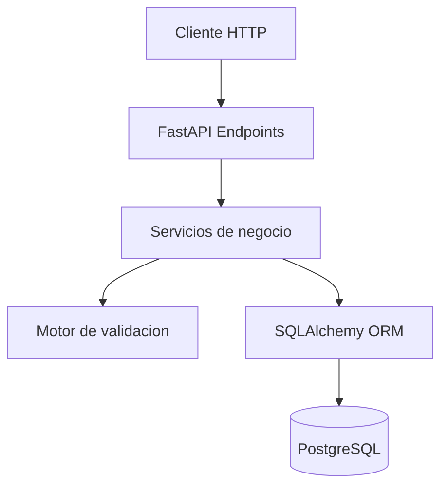
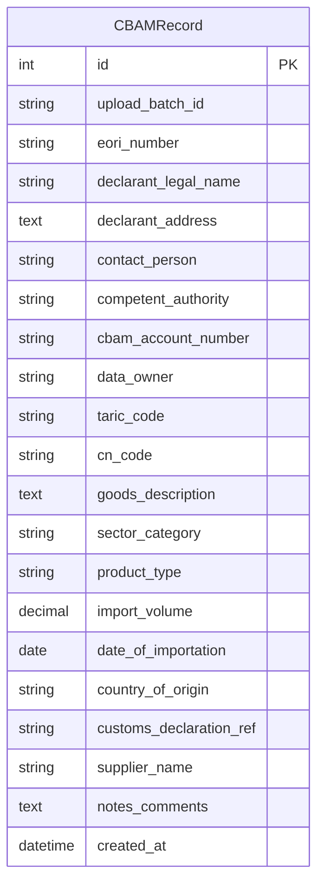

# CBAM Excel Validator API

API backend en Python para cargar archivos `.xlsx`, validar registros contra reglas del template CBAM (Carbon Border Adjustment Mechanism) y consultar datos validos con paginacion.

## Requisitos

- Docker
- Docker Compose
- Git, si vas a clonar el repositorio

## Estructura

```text
cbam_excel_validator_api/
├── app/
│   ├── api/
│   ├── core/
│   ├── models/
│   ├── reference_data/
│   ├── schemas/
│   └── services/
├── alembic/
├── sample_data/
├── tests/
├── Dockerfile
├── docker-compose.yml
├── requirements.txt
└── README.md
```

## Arquitectura y Tecnologias

El proyecto esta organizado por capas, con separacion de responsabilidades entre API, servicios, validacion y persistencia.

### Diagrama de Arquitectura



### Tecnologias y Stack

- FastAPI: framework web asincrono.
- Pydantic: esquemas de datos y validacion.
- SQLAlchemy y Alembic: ORM y migraciones de base de datos.
- PostgreSQL: motor relacional.
- Pandas y Openpyxl: lectura y manejo de archivos Excel.
- Docker y Docker Compose: contenerizacion.

## Modelo Entidad-Relacion



La persistencia se organiza por lotes de carga a traves de `upload_batch_id`.
Eso agrega trazabilidad sobre cada archivo cargado y es un plus del diseño, porque permite agrupar registros, auditar cargas y depurar incidencias con mas facilidad.

## Ejecutar con Docker y PostgreSQL

1. Levanta el servicio de base de datos y la API.

```bash
docker compose up --build -d
```

2. Abre Swagger UI para probar los endpoints.

```text
http://localhost:8000/docs
```

El contenedor `api` usa `DATABASE_URL=postgresql+psycopg2://cbam:cbam@db:5432/cbam` y espera a que PostgreSQL responda con `pg_isready` antes de iniciar.

## Base de datos

La base de datos se ejecuta como un servicio aparte dentro de Docker Compose.
El servicio se llama `db`, usa la imagen `postgres:16-alpine` y persiste datos en el volumen `postgres_data`.

## Migraciones

Alembic esta disponible como mecanismo opcional para administrar cambios de esquema.
La aplicacion tambien crea las tablas al iniciar, asi que para levantar el entorno local no es obligatorio ejecutarlo.

Para aplicar migraciones manualmente dentro del contenedor:

```bash
docker compose exec api alembic upgrade head
```

Para crear una nueva migracion:

```bash
docker compose exec api alembic revision --autogenerate -m "change description"
```

## Endpoints

### `POST /upload`

Carga un archivo `.xlsx`, valida encabezados, valida cada fila y guarda únicamente los registros válidos.

Ejemplo de respuesta:

```json
{
  "total_rows": 3,
  "valid_rows": 1,
  "invalid_rows": 2,
  "saved_batch_id": "f0d708f2-3e6a-4e7b-8a74-2da804f1e5fd",
  "errors": [
    {
      "row": 3,
      "field": "Import Volume",
      "value": -5,
      "message": "Must be a positive number"
    }
  ]
}
```

### `GET /records?page=1&page_size=20`

Consulta registros cargados con paginación.

Ejemplo de respuesta:

```json
{
  "page": 1,
  "page_size": 20,
  "total": 100,
  "items": []
}
```

### `GET /health`

Endpoint simple para verificar que la API está viva.

## Validaciones

La API valida los 18 campos reales del template:

1. `EORI Number`
2. `Declarant Legal Name`
3. `Declarant Address`
4. `Contact Person`
5. `Competent Authority`
6. `CBAM Account Number`
7. `Data Owner`
8. `TARIC Code`
9. `CN Code`
10. `Goods Description`
11. `Sector Category`
12. `Product Type`
13. `Import Volume`
14. `Date of importation`
15. `Country of Origin`
16. `Customs Declaration Ref`
17. `Supplier Name`
18. `Notes / Comments`

Tambien se valida:

- archivo `.xlsx`;
- encabezados exactos del template;
- campos obligatorios;
- texto no vacio;
- formato y longitud de EORI;
- TARIC Code de 10 digitos;
- CN Code de 8 digitos;
- CN Code incluido en la referencia CBAM simplificada;
- `Sector Category` coherente con el CN Code;
- `Product Type` limitado a `Simple` o `Complex`;
- contacto con nombre y metodo de contacto;
- email embebido valido en `Contact Person` y `Data Owner`;
- `Import Volume` decimal positivo;
- fecha valida en formato `DD.MM.YYYY`, `YYYY-MM-DD` o `DD/MM/YYYY`;
- pais ISO 3166-1 valido y fuera de paises UE/exentos.

## Pruebas

```bash
docker compose exec api pytest
```

Las pruebas usan PostgreSQL.

## Archivo de ejemplo

En `sample_data/sample_cbam.xlsx` hay un archivo de ejemplo con filas validas e invalidas para probar el flujo completo.

## Probar manualmente

```bash
curl -X POST "http://127.0.0.1:8000/upload" \
  -F "file=@sample_data/sample_cbam.xlsx"
```

```bash
curl "http://127.0.0.1:8000/records?page=1&page_size=20"
```
